# GitHub 开源免费 WordPress 中文主题收集

本项目旨在整理 GitHub 上优秀的开源、免费 WordPress 中文主题，方便博主和开发者寻找合适的主题。

> **注意**：部分主题可能包含付费的高级版，但本列表仅收录其开源免费版本。请在使用前仔细阅读各主题的协议和说明。

## 主题列表

### [Less](https://github.com/xzmhxdxh/Less)
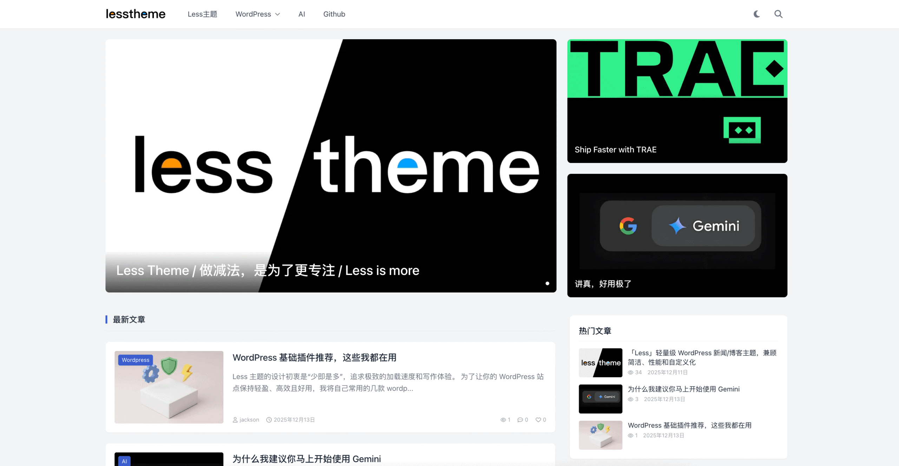
> **简介**: 一款轻量级 WordPress 主题，追求简单、极速性能，基于 Tailwind CSS 构建。  
> **最近更新**: 2025-12-29  
> **演示**: [点击查看](https://less-theme.com/)
> **仓库**: [点击查看](https://github.com/xzmhxdxh/Less)

---

### [SimpleTheme](https://github.com/worable233/SimpleTheme)
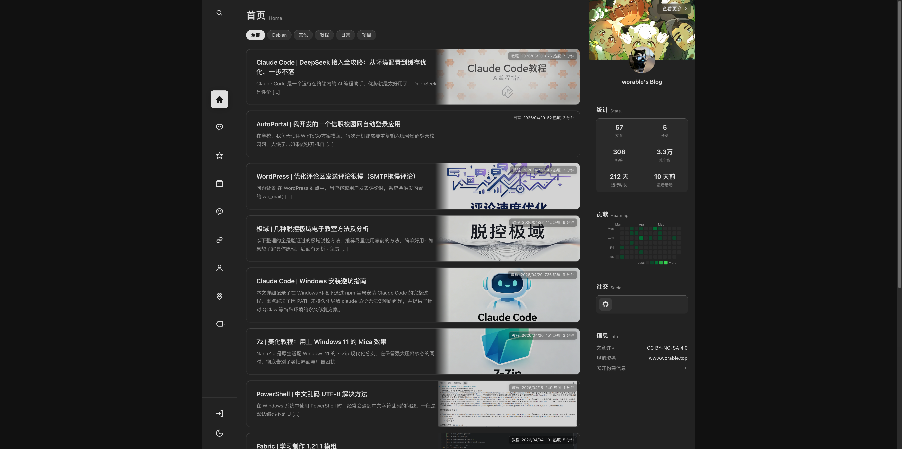
> **简介**: Vue 3 SPA × WordPress REST API 驱动的轻量现代主题，内置后台美化、爬虫检测和 SEO 友好静态输出。  
> **最近更新**: 2026-05-28  
> **演示**: [点击查看](https://www.worable.top/)
> **仓库**: [点击查看](https://github.com/worable233/SimpleTheme)

---

### [Puock](https://github.com/Licoy/wordpress-theme-puock)
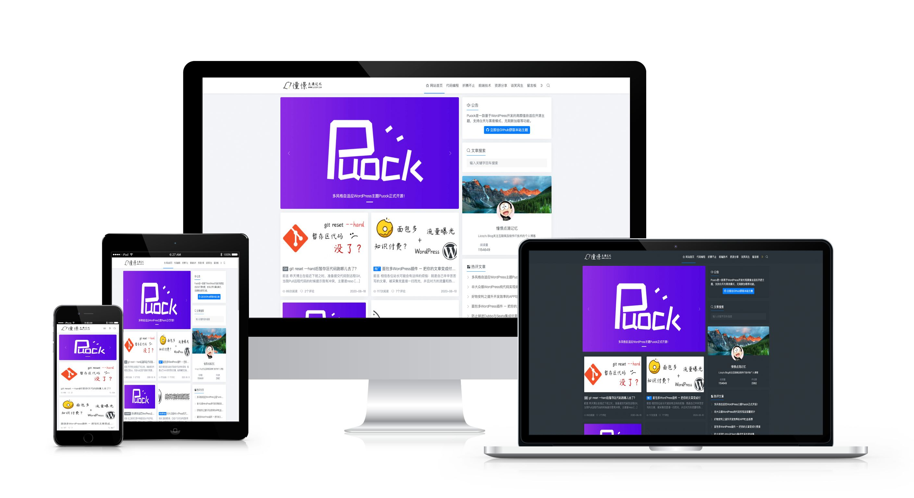
> **简介**: 一款高颜值的自适应 WordPress 主题，支持白天/黑夜模式、无刷新加载、第三方登录等功能。  
> **最近更新**: 2026-05-27  
> **演示**: [点击查看](https://licoy.cn/)
> **仓库**: [点击查看](https://github.com/Licoy/wordpress-theme-puock)

---

### [Argon](https://github.com/solstice23/argon-theme)
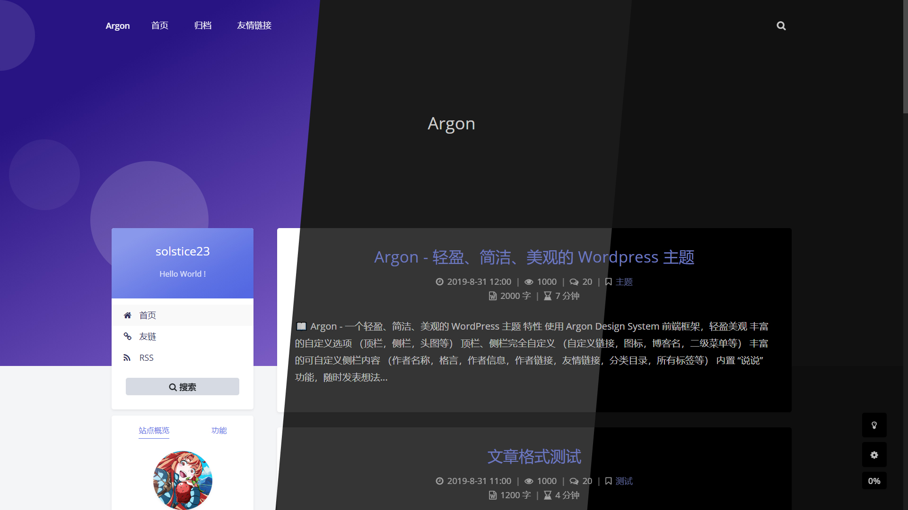
> **简介**: 轻盈、简洁、美观的主题，高度可定制化，支持日夜间模式、Pjax 无刷新加载等。  
> **最近更新**: 2026-04-16  
> **演示**: [点击查看](https://archive-blog.s23.moe/)
> **仓库**: [点击查看](https://github.com/solstice23/argon-theme)

---

### [Sakurairo](https://github.com/mirai-mamori/Sakurairo)
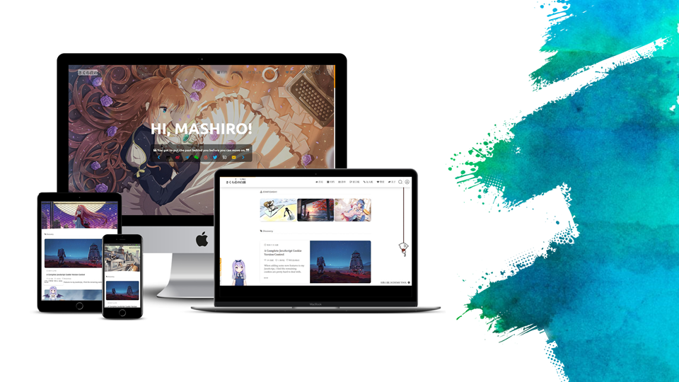
> **简介**: 基于 Sakura 主题的二次开发版本，色彩丰富，易于上手，功能完善。  
> **最近更新**: 2026-04-02  
> **演示**: [点击查看](https://iro.tw/demo.html)
> **仓库**: [点击查看](https://github.com/mirai-mamori/Sakurairo)

---

### [niRvana](https://github.com/michaelliunsky/niRvana-theme)
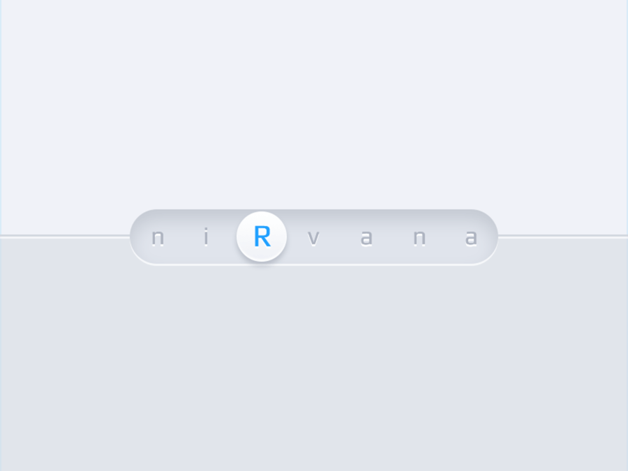
> **简介**: 轻拟物 WordPress 主题，HTML5/CSS3，响应式，支持语音朗读，深色模式等。  
> **最近更新**: 2026-02-26  
> **演示**: [点击查看](https://blog.mkliu.top/)
> **仓库**: [点击查看](https://github.com/michaelliunsky/niRvana-theme)

---

### [BenjiyunAI](https://github.com/JeyooZ/wp-theme-BenjiyunAI)
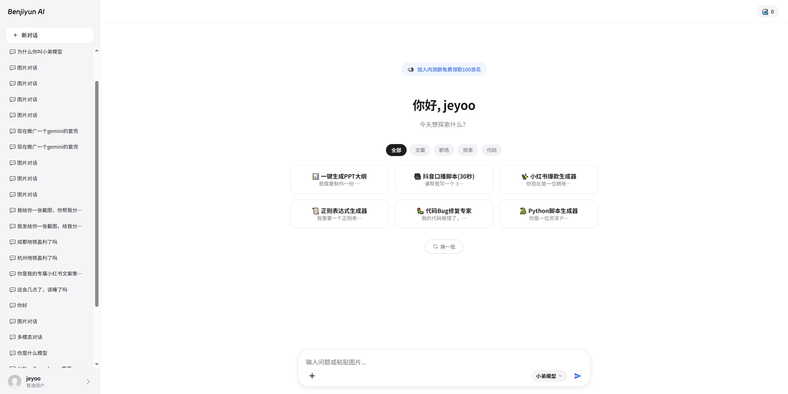
> **简介**: 专为 WordPress 打造的 AI 聚合对话主题，集成会员订阅、卡密充值、自定义模型接入等全套 SaaS 运营功能。  
> **最近更新**: 2026-01-29  
> **演示**: [点击查看](https://ai.benjiyun.com/)
> **仓库**: [点击查看](https://github.com/JeyooZ/wp-theme-BenjiyunAI)

---

### [Yowao](https://github.com/aihubpro/yowao)
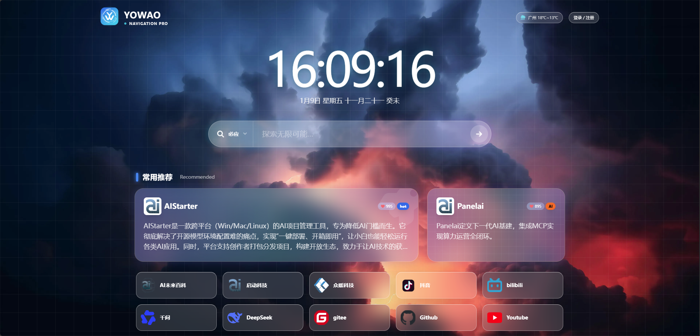
> **简介**: 极速 · 安全 · 高颜值 —— 专为国人打造的极客导航主题。独特的“棱镜”视觉风格，集成银行级 CSRF 安全防护。  
> **最近更新**: 2026-01-13  
> **演示**: [点击查看](https://www.yowao.com/)
> **仓库**: [点击查看](https://github.com/aihubpro/yowao)

---

### [OneNice](https://github.com/xenice/onenice)
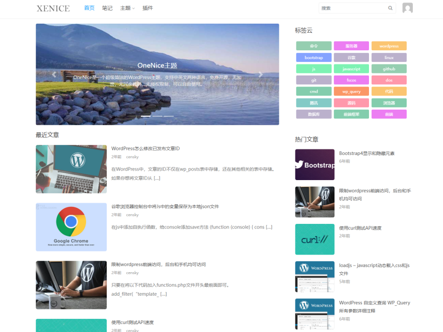
> **简介**: 超级简洁的 WordPress 主题，无任何加密和冗余代码，支持中英文。  
> **最近更新**: 2025-11-23  
> **演示**: [点击查看](https://www.xenice.com/zh/onenice/)
> **仓库**: [点击查看](https://github.com/xenice/onenice)

---

### [Kratos](https://github.com/Vtrois/Kratos)
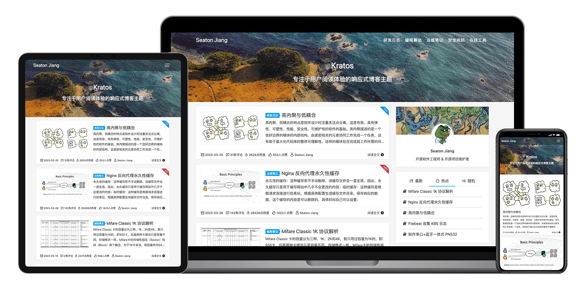
> **简介**: 专注于阅读体验的响应式博客主题，简洁大方，速度快。  
> **最近更新**: 2025-11-17  
> **演示**: [点击查看](https://www.nbmao.com/)
> **仓库**: [点击查看](https://github.com/Vtrois/Kratos)

---

### [Puma](https://github.com/bigfa/Puma)
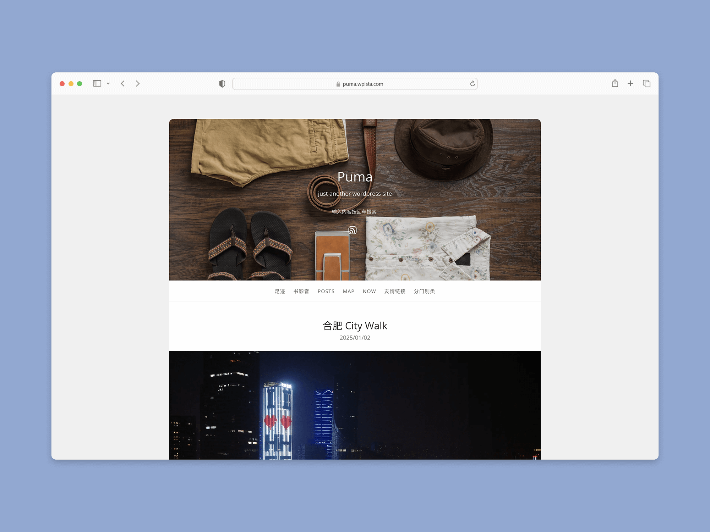
> **简介**: 一款简洁的单栏 WordPress 主题，适合个人博客，支持响应式设计、多种文章格式、Ajax 评论提交等功能。  
> **最近更新**: 2025-08-26  
> **演示**: [点击查看](https://fatesinger.com/76733)
> **仓库**: [点击查看](https://github.com/bigfa/Puma)

---

### [Document](https://github.com/friend-nicen/theme-document)
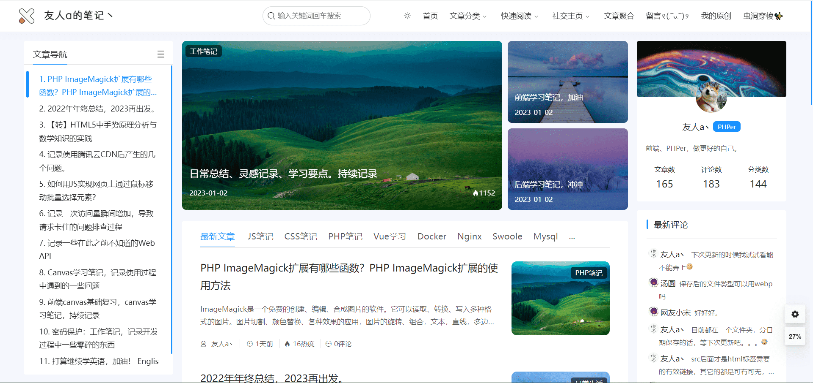
> **简介**: 一个基于文档类型的博客主题，更加方便的记录、查询学习笔记。  
> **最近更新**: 2025-07-25  
> **演示**: [点击查看](https://nicen.cn/1552.html)
> **仓库**: [点击查看](https://github.com/friend-nicen/theme-document)

---

### [Once](https://github.com/HUiTHEME/Once)
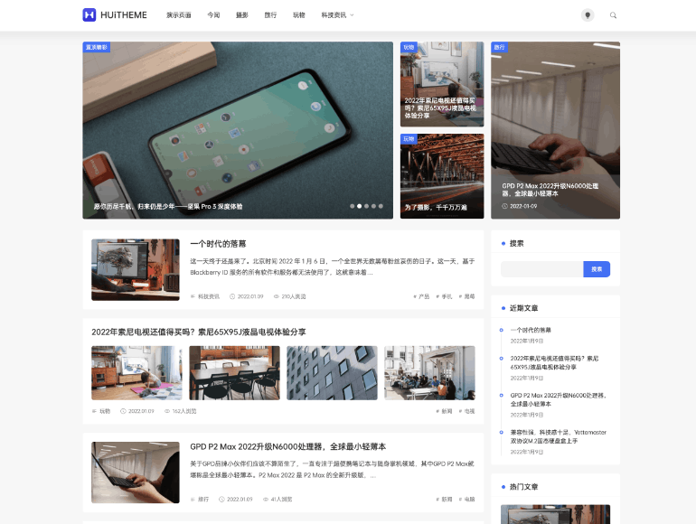
> **简介**: 一款满足绝大部分人群需求的博客主题，正如其名，一旦拥有，别无他求。  
> **最近更新**: 2025-06-11  
> **演示**: [点击查看](https://www.huitheme.com/once-theme.html)
> **仓库**: [点击查看](https://github.com/HUiTHEME/Once)

---

### [WebStack](https://github.com/owen0o0/WebStack)
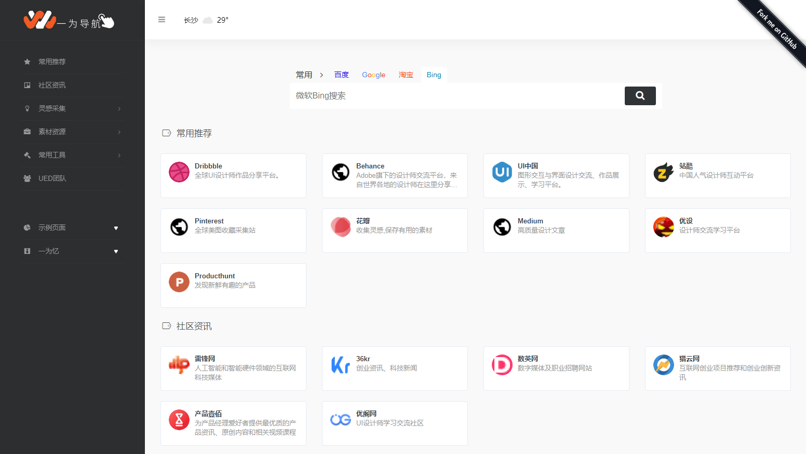
> **简介**: WordPress 版 WebStack 导航主题，适合做网址导航网站。  
> **最近更新**: 2025-04-01  
> **演示**: [点击查看](https://webstack.iotheme.cn/)
> **仓库**: [点击查看](https://github.com/owen0o0/WebStack)

---

### [Lolimeow](https://github.com/baomihuahua/lolimeow)

> **简介**: 一款二次元风格的 WordPress 主题，支持暗黑模式、3模切换、会员中心、图片懒加载等功能。  
> **最近更新**: 2025-03-18  
> **演示**: [点击查看](https://www.boxmoe.com/)
> **仓库**: [点击查看](https://github.com/baomihuahua/lolimeow)

---

### [MDx](https://github.com/yrccondor/mdx)
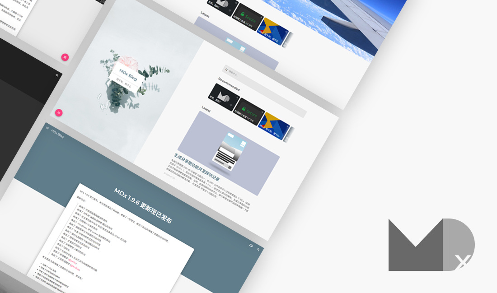
> **简介**: 遵循 Material Design 风格，功能强大，轻量且快速。  
> **最近更新**: 2024-11-15  
> **演示**: [点击查看](https://flyhigher.top/)
> **仓库**: [点击查看](https://github.com/yrccondor/mdx)

---

### [CorePress](https://github.com/ghboke/CorePressWPTheme)

> **简介**: 深度优化，体积小，性能强，专为极客制作的多功能主题。  
> **最近更新**: 2022-05-23  
> **演示**: -
> **仓库**: [点击查看](https://github.com/ghboke/CorePressWPTheme)

## 贡献

欢迎提交 Pull Request 补充更多优秀的开源免费 WordPress 中文主题！请确保推荐的主题满足以下条件：
1. 托管在 GitHub 上。
2. 或者是开源且免费的。
3. 支持中文。

## 免责声明

本列表仅作收集整理，主题的安全性和稳定性请自行评估。
